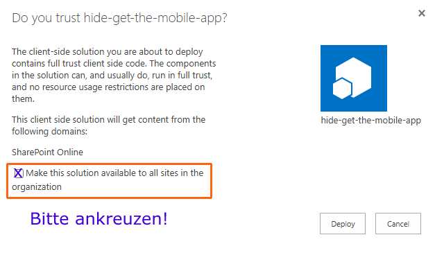

# Hide "Get the Mobile App" — SPFx Solution

A SharePoint Framework (SPFx) solution that hides the **"Get the mobile app"** promotional UI from SharePoint SE pages. Two independent hides are provided and can be enabled separately:

1. **In-page banner** — the `<div class="feedback_…">` container above the page content (an SPFx Application Customizer registered via PowerShell).
2. **Footer button** — the `<a class="MobileUpsellFooterButtonView">` link at the bottom of MySite pages (a plain JavaScript file shipped as a ClientSideAsset and registered via a ScriptLink user custom action).

## Table of Contents

- [Download](#download)
- [Deployment](#deployment)
  - [1. Upload the package to the App Catalog](#1-upload-the-package-to-the-app-catalog)
  - [2. Hide the in-page banner](#2-hide-the-in-page-banner)
  - [3. Hide the footer button](#3-hide-the-footer-button)
- [How It Works](#how-it-works)
- [Known Limitations](#known-limitations)
- [Prerequisites for Building from Source](#prerequisites-for-building-from-source)
- [Building from Source](#building-from-source)
- [Releasing a New Version](#releasing-a-new-version-maintainer)
- [Compatibility](#compatibility)
- [Version History](#version-history)
- [Author](#author)
- [License](#license)

## Download

Pre-built `.sppkg` packages are published as **GitHub Releases**:

> [**Download the latest release →**](https://github.com/matthias-glubrecht/HideGetMobileApp/releases/latest)

Grab `hide-get-mobile-app.sppkg` from the release assets. (No need to clone or build the repository unless you want to modify it — see [Building from Source](#building-from-source).)

## Deployment

### 1. Upload the package to the App Catalog

1. Upload `hide-get-mobile-app.sppkg` to your SharePoint **App Catalog**.
2. When prompted, select **"Make this solution available to all sites in the organization"**.

   

   This makes the solution available but does **not** activate either hide on any site yet.
3. Trust the solution when prompted.

After deployment you can enable the two hides independently using the PowerShell scripts in the `deployment` folder. Both hides target a single site collection per invocation — repeat per site collection as needed.

The `deployment` folder contains:

| Script | Purpose |
|---|---|
| `HideMobileUpsellLink.ps1` | Adds the **in-page banner** hide to a site collection. |
| `UnhideMobileUpsellLink.ps1` | Removes the in-page banner hide. |
| `HideMobileUpsellButton.ps1` | Adds the **footer button** hide to a site collection (typically the MySite host). |
| `UnhideMobileUpsellButton.ps1` | Removes the footer button hide. |
| `AddOrRemoveUserCustomAction.ps1` | Shared CSOM helper used by all four wrappers. Supports both `ApplicationCustomizer` and `ScriptLink` parameter sets. |

> All scripts use the SharePoint CSOM client DLLs and run with the executing user's Windows credentials. The DLLs are auto-located from the SharePoint hive (v16 → v15 → script folder).

### 2. Hide the in-page banner

Run from the `deployment` folder, against any site collection where the banner should be hidden:

```powershell
.\HideMobileUpsellLink.ps1 -siteCollectionUrl "https://yourserver/sites/yoursite"
```

To remove:

```powershell
.\UnhideMobileUpsellLink.ps1 -siteCollectionUrl "https://yourserver/sites/yoursite"
```

This registers/removes a `ClientSideExtension.ApplicationCustomizer` UserCustomAction on the site collection.

### 3. Hide the footer button

Run from the `deployment` folder. Typically targeted at the **MySite host** site collection (where the footer button appears):

```powershell
.\HideMobileUpsellButton.ps1 `
    -siteCollectionUrl "https://yourserver/my" `
    -appCatalogUrl     "https://yourserver/sites/appcatalog"
```

To remove:

```powershell
.\UnhideMobileUpsellButton.ps1 `
    -siteCollectionUrl "https://yourserver/my" `
    -appCatalogUrl     "https://yourserver/sites/appcatalog"
```

This registers/removes a `Location="ScriptLink"` UserCustomAction whose `ScriptSrc` points at `HideMobileUpsellButton.js`, served from `{appCatalogUrl}/ClientSideAssets/025c4c9b-56f3-47ce-b70d-49ee31584f10/HideMobileUpsellButton.js` (the file is bundled inside the `.sppkg`).

## How It Works

### In-page banner (Application Customizer)

The SPFx Application Customizer (`HideMobileUpsellLinkApplicationCustomizer`) injects a `<style>` element into the page on `onInit`:

```css
div[class*="feedback_"]:has(> a[class*="MobileUpsellView_"]) {
  display: none !important;
}
```

This targets the `<div>` container that wraps the in-page "Get the mobile app" link.

### Footer button (ScriptLink)

`HideMobileUpsellButton.js` is a small IIFE that runs on `DOMContentLoaded` and injects:

```css
a.MobileUpsellFooterButtonView { display: none !important; }
```

It guards against duplicate injection via a fixed `<style>` element id (`HideMobileUpsellButton-StyleTag`).

> **⚠️ Important:** Both selectors have only been tested on **SharePoint SE Communication Sites and the MySite host**. They may not work — or may target different elements — on Team Sites or future SharePoint UI updates. Microsoft may change the underlying DOM structure at any time without notice.

## Known Limitations

### The SharePoint Start Page (`/_layouts/15/sharepoint.aspx`) cannot be customized

The **"Get the mobile app" footer button is also rendered on the SharePoint Start Page** (`https://<host>/_layouts/15/sharepoint.aspx`), and **this solution cannot hide it there**.

The Start Page is a tenant/farm-level React single-page app served from `/_layouts/`. Unlike modern site pages it has no site context, so SharePoint Server SE/2019 deliberately does **not** load any site-scoped customization mechanism on it:

| Mechanism | Loaded on `sharepoint.aspx`? |
|---|---|
| SPFx Application Customizer (`Site.UserCustomActions`) | ❌ No |
| ScriptLink UserCustomAction | ❌ No |
| Tenant-Wide Extensions | ❌ No |
| `Web.AlternateCssUrl` | ❌ No |

There is no supported server-side extensibility seam for this page. If hiding the footer button on the Start Page is a hard requirement, the only realistic options are out of scope for this solution:

- **Force-installed Edge extension (recommended)** — package a tiny Manifest V3 extension whose only job is to apply `a.MobileUpsellFooterButtonView { display: none !important; }` as a `content_scripts` CSS rule scoped to `*://*/_layouts/15/sharepoint.aspx*`. Force-install it via group policy (`ExtensionInstallForcelist`) or Intune, hosted either on the Edge Add-ons store (private listing) or self-hosted with `ExtensionInstallSources`. Officially supported on both the SharePoint and the Edge side, survives every SharePoint cumulative update, scopable to OUs/groups via standard GPO targeting, no SharePoint-side modifications. Owned by the desktop-management team, not by this repo.
- **Reverse-proxy CSS injection** — inject a `<style>` block into responses for `sharepoint.aspx` at your reverse proxy (IIS URL Rewrite outbound rule, nginx `sub_filter`, etc.). Works, survives SP updates, but adds operational burden on the proxy team.
- **Modifying files in the SharePoint hive** (e.g. patching `…\16\TEMPLATE\LAYOUTS\sharepoint.aspx` directly) — explicitly **unsupported** by Microsoft and silently overwritten by every cumulative update. **Do not do this.**

The in-page banner hide and the footer-button hide shipped here cover modern site pages and the MySite host respectively — the surfaces where extensibility is actually permitted.

## Prerequisites for Building from Source

Only required if you want to modify the solution. End users who only need to deploy can skip ahead to [Download](#download).

| Tool | Version |
|---|---|
| **Node.js** | 8.17.x (see `.nvmrc`) |
| **SharePoint Framework** | 1.4.1 |
| **Gulp** | 3.x (installed globally) |
| **Yeoman** | 3.x (installed globally) |

> **Note:** Node.js 8.17 is required for SPFx 1.4.1 compatibility. Newer Node versions may break the build. Use [nvm-windows](https://github.com/coreybutler/nvm-windows) to manage multiple Node.js versions.

## Building from Source

1. Clone the repository:

   ```bash
   git clone https://github.com/matthias-glubrecht/HideGetMobileApp.git
   cd HideGetMobileApp
   ```

2. Install dependencies:

   ```bash
   npm install
   ```

3. Bundle and package (production build):

   ```bash
   gulp clean
   gulp bundle --ship
   gulp package-solution --ship
   ```

   The output `.sppkg` is created at `sharepoint/solution/hide-get-mobile-app.sppkg` and contains both the SPFx Application Customizer and the plain `HideMobileUpsellButton.js` file (the latter is copied into `temp/deploy/` by a custom `copy-extra-assets` Gulp post-build task and packaged as a ClientSideAsset).

## Releasing a New Version (maintainer)

1. Bump `version` in [package.json](package.json) (e.g. `1.1.0` → `1.2.0`) and `version` in [config/package-solution.json](config/package-solution.json) (e.g. `1.1.0.0` → `1.2.0.0`). Keep them in sync.
2. Build the production package as above.
3. Commit, tag, and push:

   ```bash
   git commit -am "Release v1.2.0"
   git tag v1.2.0
   git push origin main --tags
   ```

4. On GitHub, create a [new Release](https://github.com/matthias-glubrecht/HideGetMobileApp/releases/new) for the tag, write release notes, and **upload `sharepoint/solution/hide-get-mobile-app.sppkg` as a release asset**.

> The repository's `.gitignore` excludes `*.sppkg` — built packages are intentionally never committed; they live only in GitHub Releases.

## Compatibility

| Aspect | Details |
|---|---|
| **SharePoint Framework** | 1.4.1 |
| **Node.js (build only)** | 8.17.x |
| **SharePoint SE Communication Sites** | ✅ Tested (in-page banner) |
| **SharePoint SE MySite host** | ✅ Tested (footer button) |
| **SharePoint Start Page (`/_layouts/15/sharepoint.aspx`)** | ❌ Not customizable — see [Known Limitations](#known-limitations) |
| **Any other SharePoint Versions or Sites** | ❓ Not tested |

## Version History

| Version | Date | Notes |
|---|---|---|
| 1.1.0 | 2026-05-07 | Adds footer-button hide (ScriptLink + `HideMobileUpsellButton.js`). Refactored deployment scripts: combined `AddOrRemoveUserCustomAction.ps1` core, new `HideMobileUpsellButton.ps1` / `UnhideMobileUpsellButton.ps1` wrappers. Removed unused Feature-framework wiring (`elements.xml`, `ClientSideInstance.xml`). Distribution moved to GitHub Releases. |
| 1.0.0 | 2026-02-16 | Initial release — Application Customizer hides the in-page "Get the mobile app" banner. |

## Author

**Matthias Glubrecht**

## License

This project is licensed under the [MIT License](LICENSE).
